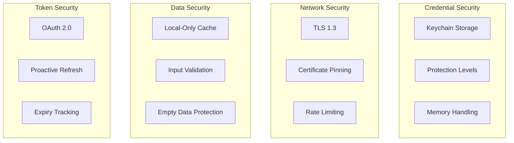
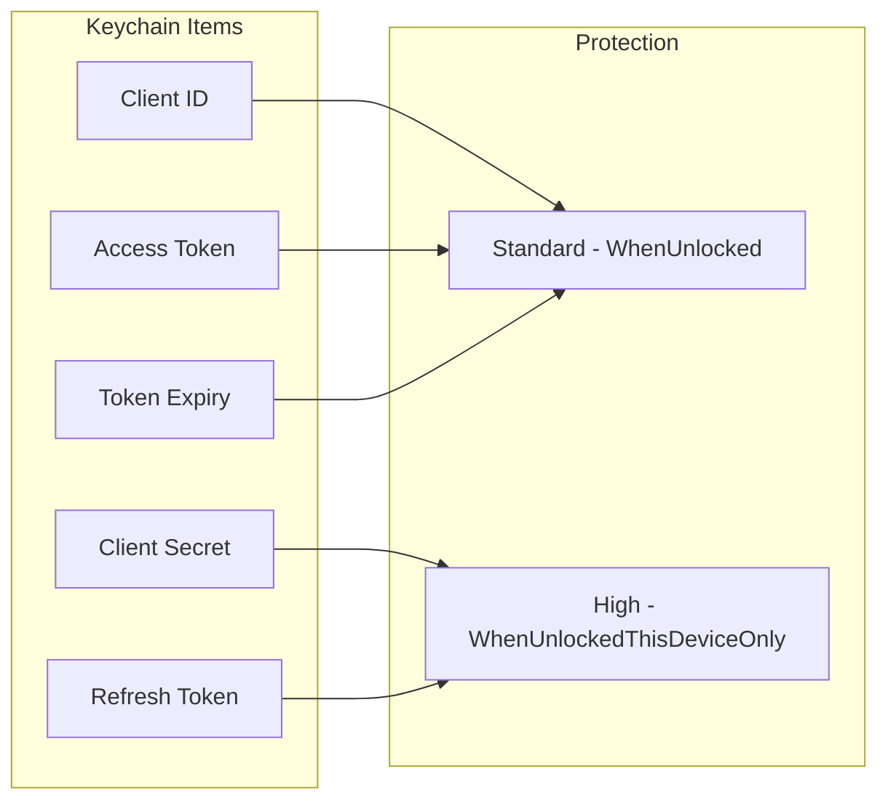
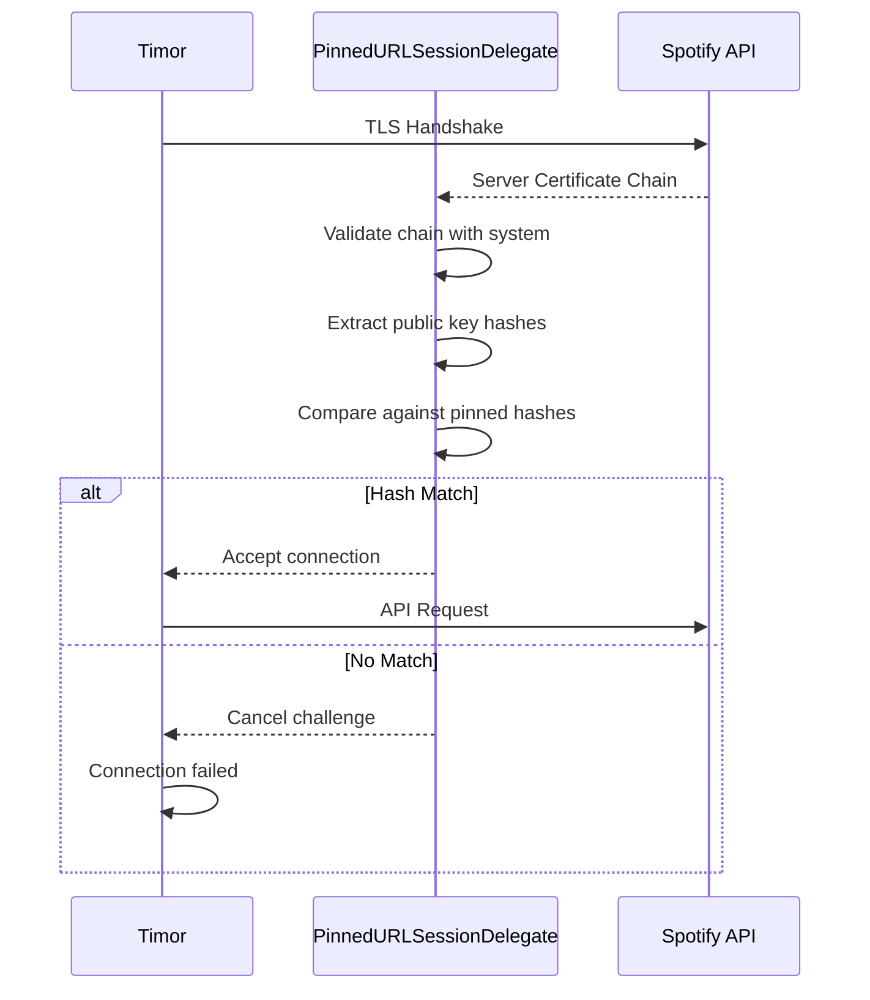
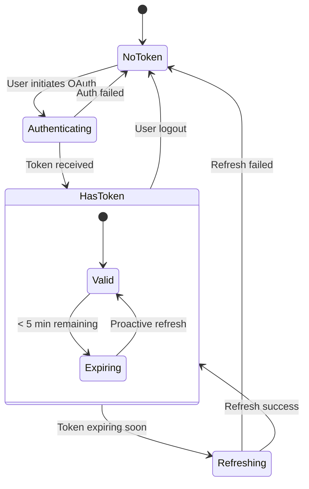

# Security Architecture

This document details Timor's security measures for credential storage, network communication, and data protection.

## Security Overview



## Credential Storage

### Keychain Architecture

All sensitive credentials are stored in macOS Keychain:



### Protection Levels

```swift
enum ProtectionLevel {
    case standard   // kSecAttrAccessibleWhenUnlocked
    case high       // kSecAttrAccessibleWhenUnlockedThisDeviceOnly
    case sensitive  // User Presence Required (biometrics)
}
```

| Level | Accessibility | Use Case |
|-------|---------------|----------|
| Standard | When device unlocked | Non-sensitive data (Client ID) |
| High | When unlocked, this device only | Secrets (Client Secret, Refresh Token) |
| Sensitive | Requires biometrics | Future: optional for all tokens |

### KeychainManager Implementation

```swift
func save(_ value: String, for key: String, protection: ProtectionLevel) throws {
    guard let data = value.data(using: .utf8) else {
        throw KeychainError.invalidData
    }

    let accessibility: CFString
    switch protection {
    case .standard:
        accessibility = kSecAttrAccessibleWhenUnlocked
    case .high:
        accessibility = kSecAttrAccessibleWhenUnlockedThisDeviceOnly
    case .sensitive:
        // Create access control requiring user presence
        var error: Unmanaged<CFError>?
        let accessControl = SecAccessControlCreateWithFlags(
            kCFAllocatorDefault,
            kSecAttrAccessibleWhenUnlockedThisDeviceOnly,
            .userPresence,
            &error
        )
        // ...
    }

    let query: [String: Any] = [
        kSecClass as String: kSecClassGenericPassword,
        kSecAttrService as String: Constants.Keychain.service,
        kSecAttrAccount as String: key,
        kSecValueData as String: data,
        kSecAttrAccessible as String: accessibility
    ]

    // Delete existing then add new
    SecItemDelete(query as CFDictionary)
    let status = SecItemAdd(query as CFDictionary, nil)
}
```

### Auto-Protection by Key Type

```swift
func save(_ value: String, for key: String) throws {
    let protection: ProtectionLevel
    switch key {
    case Constants.Keychain.clientSecretKey,
         Constants.Keychain.refreshTokenKey:
        protection = .high  // Sensitive credentials
    default:
        protection = .standard
    }
    try save(value, for: key, protection: protection)
}
```

## Network Security

### Certificate Pinning

Timor implements certificate pinning to prevent MITM attacks:



### Pinned Certificate Hashes

```swift
private static let pinnedPublicKeyHashes: Set<String> = [
    // Leaf certificate (rotates annually)
    "88b56ec2e245e6042cff85bab64e91872a6d7d7caff3af38582334d44dcba3b7",

    // Intermediate CA (more stable)
    "ebf967039a1282fcd6aebe815e06e39f7b7cf05b3fc3768a7c24bc6fcb12a0cb",

    // Root CA (rarely changes)
    "93336939b223ecf6b3a33598be91ad79f8ab826693f8ac50cd827008eca78968",
]
```

### Hash Extraction Process

To update hashes when Spotify rotates certificates:

```bash
# Get leaf certificate hash
echo | openssl s_client -servername api.spotify.com -connect api.spotify.com:443 2>/dev/null \
  | openssl x509 -pubkey -noout | openssl pkey -pubin -outform DER \
  | openssl dgst -sha256 -hex | awk '{print $NF}'
```

### Certificate Validation

```swift
func urlSession(_ session: URLSession, didReceive challenge: URLAuthenticationChallenge,
                completionHandler: @escaping (URLSession.AuthChallengeDisposition, URLCredential?) -> Void) {
    guard challenge.protectionSpace.authenticationMethod == NSURLAuthenticationMethodServerTrust,
          let serverTrust = challenge.protectionSpace.serverTrust else {
        completionHandler(.cancelAuthenticationChallenge, nil)
        return
    }

    // Verify certificate chain is valid
    var error: CFError?
    let isValid = SecTrustEvaluateWithError(serverTrust, &error)
    guard isValid else {
        completionHandler(.cancelAuthenticationChallenge, nil)
        return
    }

    // Check pinned hashes
    guard let certificates = SecTrustCopyCertificateChain(serverTrust) as? [SecCertificate] else {
        completionHandler(.cancelAuthenticationChallenge, nil)
        return
    }

    for certificate in certificates {
        if let publicKey = SecCertificateCopyKey(certificate),
           let publicKeyData = SecKeyCopyExternalRepresentation(publicKey, nil) as Data? {
            let hash = SHA256.hash(data: publicKeyData)
            let hashString = hash.compactMap { String(format: "%02x", $0) }.joined()

            if pinnedPublicKeyHashes.contains(hashString) {
                completionHandler(.useCredential, URLCredential(trust: serverTrust))
                return
            }
        }
    }

    // No matching hash found
    completionHandler(.cancelAuthenticationChallenge, nil)
}
```

## Memory Security

### Minimizing Secret Exposure

```swift
/// Creates Basic Auth header with minimal secret exposure
private func createBasicAuthHeader() -> String? {
    guard let clientIdData = clientID.data(using: .utf8),
          let secretData = getClientSecretData() else {
        return nil
    }

    // Combine credentials
    var credentials = clientIdData
    credentials.append(":".data(using: .utf8)!)
    credentials.append(secretData)

    let base64 = credentials.base64EncodedString()

    // Clear sensitive data from memory
    credentials.resetBytes(in: 0..<credentials.count)

    return "Basic \(base64)"
}
```

### Secret Retrieval Pattern

```swift
/// Retrieves client secret securely - minimizes time in memory
private func getClientSecretData() -> Data? {
    guard let secret = try? keychain.retrieve(for: "spotify_client_secret"),
          !secret.isEmpty else {
        return nil
    }
    // Returns Data directly, string is released
    return secret.data(using: .utf8)
}
```

## Token Security

### Token Lifecycle



### Proactive Token Refresh

```swift
private func setupTokenRefreshTimer() {
    // Check every 60 seconds
    tokenRefreshTimer = Timer.scheduledTimer(withTimeInterval: 60, repeats: true) { _ in
        Task { @MainActor in
            await self.checkAndRefreshTokenIfNeeded()
        }
    }
}

private func checkAndRefreshTokenIfNeeded() async {
    guard let expiryDate = tokenExpiryDate else { return }

    // Refresh 5 minutes before expiry
    let fiveMinutesFromNow = Date().addingTimeInterval(5 * 60)
    if expiryDate < fiveMinutesFromNow && refreshToken != nil {
        _ = await refreshAccessToken()
    }
}
```

### Token Storage Security

| Token | Keychain Key | Protection | Notes |
|-------|--------------|------------|-------|
| Access Token | `spotify_web_access_token` | Standard | Short-lived (~1 hour) |
| Refresh Token | `spotify_web_refresh_token` | High | Long-lived, device-bound |
| Token Expiry | `spotify_token_expiry` | Standard | Timestamp for refresh timing |

## OAuth Security

### CSRF Protection

```swift
func authenticate() {
    let state = UUID().uuidString  // Random state parameter

    var components = URLComponents(string: authURL)!
    components.queryItems = [
        URLQueryItem(name: "client_id", value: clientID),
        URLQueryItem(name: "response_type", value: "code"),
        URLQueryItem(name: "redirect_uri", value: redirectURI),
        URLQueryItem(name: "scope", value: scopes),
        URLQueryItem(name: "state", value: state)  // CSRF token
    ]
    // ...
}
```

### Secure Authentication Session

```swift
// ASWebAuthenticationSession provides:
// - Isolated browser context
// - No cookie sharing with Safari
// - System-managed credential handling
authSession = ASWebAuthenticationSession(
    url: authURL,
    callbackURLScheme: "timor"
) { callbackURL, error in
    // Handle securely
}
authSession?.prefersEphemeralWebBrowserSession = true  // Optional: even more isolated
```

## Data Validation

### Input Sanitization

```swift
// Validate playlist ID format
func isValidPlaylistId(_ id: String) -> Bool {
    // Spotify IDs are 22 characters, alphanumeric
    let regex = try! Regex("^[a-zA-Z0-9]{22}$")
    return id.contains(regex)
}

// Validate track URI format
func isValidTrackUri(_ uri: String) -> Bool {
    return uri.hasPrefix("spotify:track:")
}
```

### Empty Data Protection

```swift
func cachePlaylistTracks(_ playlistId: String, tracks: [Track]) {
    // CRITICAL: Never overwrite good cache with empty data
    guard !tracks.isEmpty else {
        logger.warning("Refusing to cache empty track list")
        return
    }
    // Proceed with caching...
}
```

### Track Count Validation

```swift
let difference = abs(cachedCount - apiCount)
if difference > Constants.Validation.trackCountDifferenceThreshold {
    logger.warning("Suspicious track count mismatch: \(difference)")
    // Fetch fresh to verify
}
```

## Logging Security

### Privacy-Aware Logging

```swift
private static let logger = Logger(subsystem: "com.timor.spotify", category: "SpotifyManager")

// Good: Redact sensitive data
logger.info("Authenticated user: \(userId, privacy: .private)")
logger.debug("Fetching playlist: \(playlistId, privacy: .public)")

// Never log:
// - Tokens
// - Client secrets
// - Full user data
```

### Log Categories

| Category | Data Logged | Privacy |
|----------|-------------|---------|
| `SpotifyManager` | Operations, cache hits | Public IDs only |
| `SpotifyWebAPI` | API calls, errors | Public |
| `certificate-pinning` | Validation results | No secrets |
| `RateLimiter` | Wait times, retry counts | Public |

## Threat Model

### Protected Against

| Threat | Mitigation |
|--------|------------|
| Credential theft | Keychain with device binding |
| MITM attacks | Certificate pinning |
| Token leakage | Memory clearing, short expiry |
| CSRF | State parameter in OAuth |
| Replay attacks | Token expiry, refresh rotation |
| Cache poisoning | Snapshot validation, empty data protection |

### Not Protected Against

| Threat | Reason |
|--------|--------|
| Physical device access | OS responsibility |
| Compromised OS | OS responsibility |
| Spotify API compromise | External dependency |
| Root/jailbroken devices | User choice |

## Security Best Practices

### For Users

1. **Never share** your Client ID and Secret
2. **Disconnect** the app if device is compromised
3. **Review** connected apps at [Spotify Account](https://www.spotify.com/account/apps/)
4. **Use** device passcode/Touch ID/Face ID

### For Developers

1. **Never commit** credentials to version control
2. **Keep** certificate hashes updated
3. **Monitor** for Spotify API security advisories
4. **Test** certificate pinning with proxies like Charles/Proxyman
5. **Review** keychain access in Keychain Access.app

## Entitlements

### Required Entitlements (macOS)

```xml
<?xml version="1.0" encoding="UTF-8"?>
<!DOCTYPE plist PUBLIC "-//Apple//DTD PLIST 1.0//EN" "...">
<plist version="1.0">
<dict>
    <key>com.apple.security.app-sandbox</key>
    <true/>
    <key>com.apple.security.network.client</key>
    <true/>
    <key>keychain-access-groups</key>
    <array>
        <string>$(AppIdentifierPrefix)com.timor.spotify</string>
    </array>
</dict>
</plist>
```

### iOS Entitlements

```xml
<key>keychain-access-groups</key>
<array>
    <string>$(AppIdentifierPrefix)com.timor.spotify</string>
</array>
```
