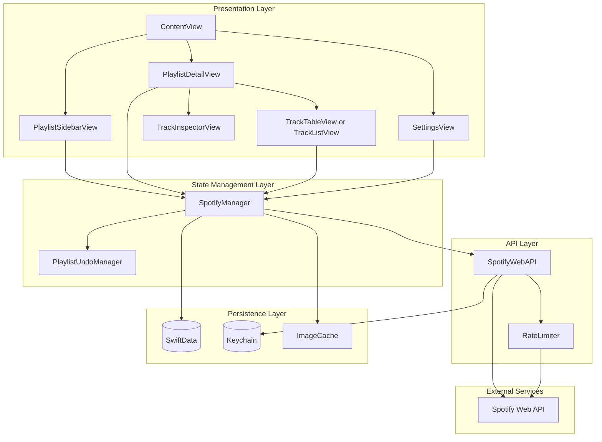
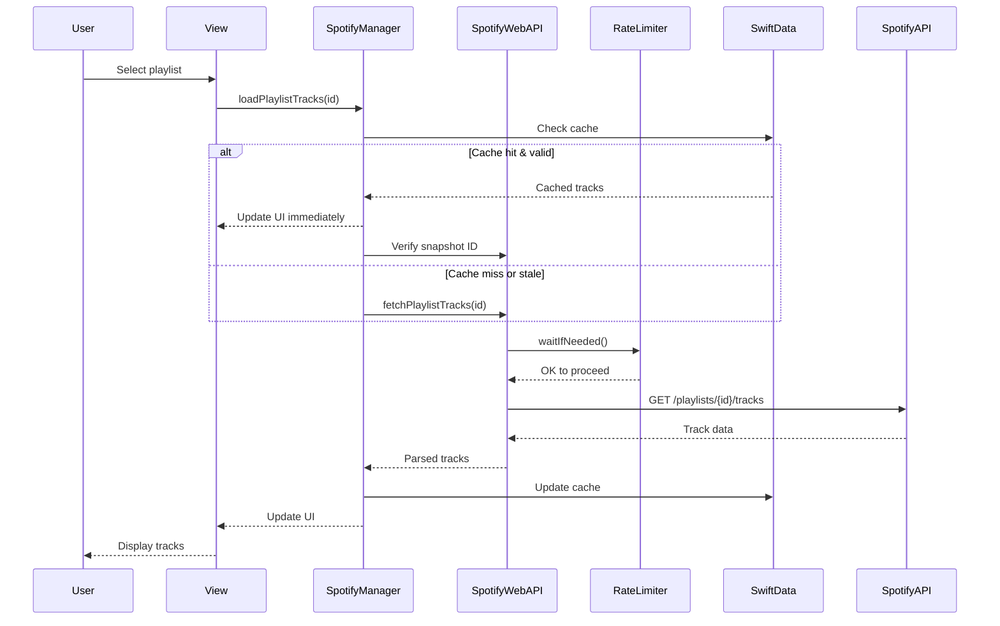
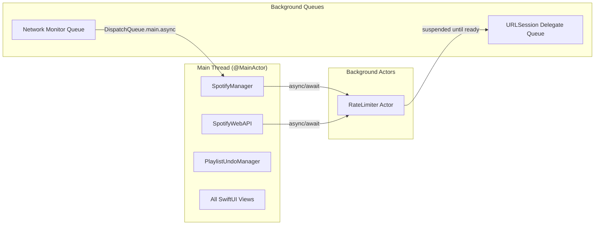
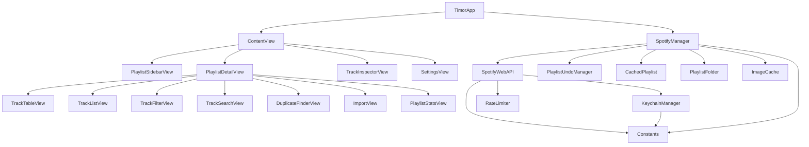
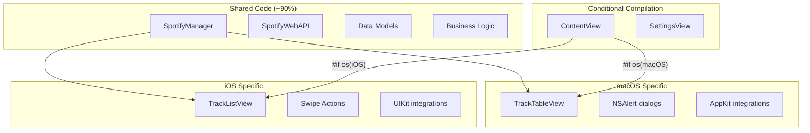
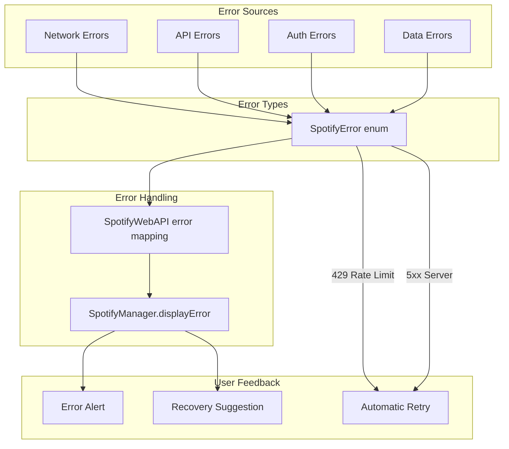
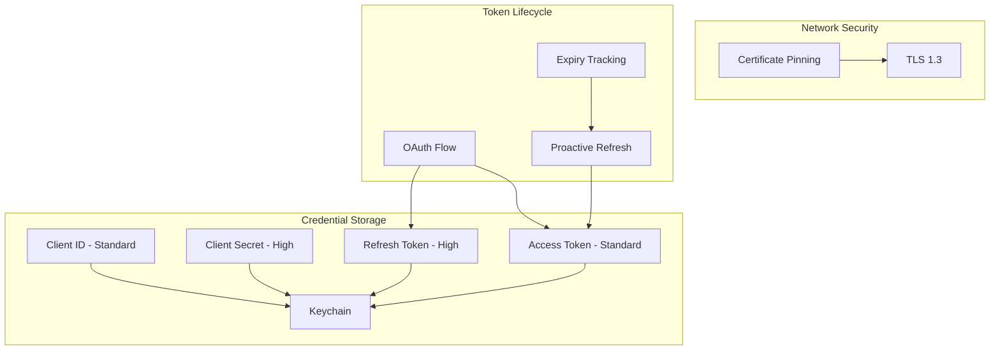
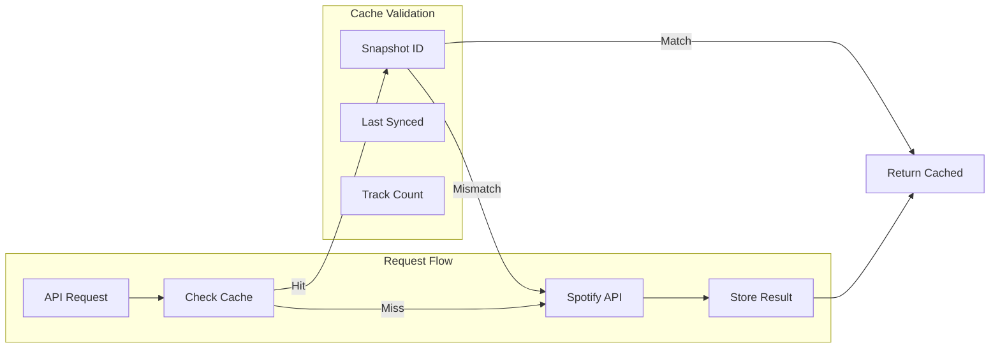
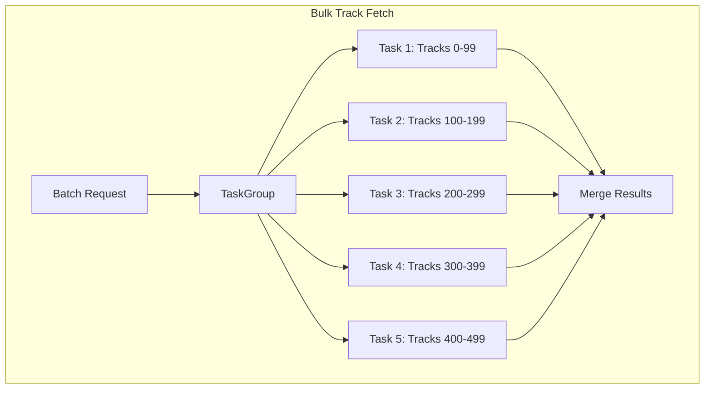
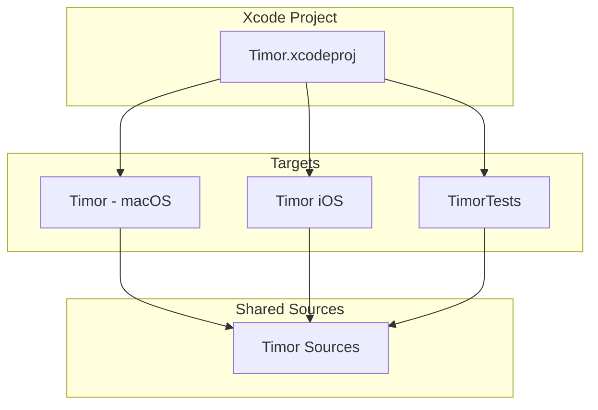

# Timor Architecture

This document provides a comprehensive overview of Timor's architecture, design patterns, and system interactions.

## System Overview



## Component Responsibilities

### Presentation Layer

| Component | Platform | Responsibility |
|-----------|----------|----------------|
| `ContentView` | Both | Main coordinator, NavigationSplitView layout |
| `PlaylistSidebarView` | Both | Playlist navigation, folder management |
| `PlaylistDetailView` | Both | Track list container, toolbar actions |
| `TrackTableView` | macOS | NSTableView-style track display |
| `TrackListView` | iOS | SwiftUI List with swipe actions |
| `TrackInspectorView` | Both | Track metadata panel |
| `SettingsView` | Both | OAuth credentials, preferences |

### State Management Layer

| Component | Responsibility |
|-----------|----------------|
| `SpotifyManager` | Central state store, business logic, caching |
| `PlaylistUndoManager` | Undo/redo stack for destructive operations |

### API Layer

| Component | Responsibility |
|-----------|----------------|
| `SpotifyWebAPI` | OAuth flow, HTTP requests, token management |
| `RateLimiter` | Request throttling, exponential backoff |

### Persistence Layer

| Component | Responsibility |
|-----------|----------------|
| SwiftData | Local playlist/track cache |
| Keychain | Secure credential storage |
| `ImageCache` | Album artwork caching |

## Data Flow



## Threading Model



### Key Threading Decisions

1. **`@MainActor` for State Classes**: `SpotifyManager`, `SpotifyWebAPI`, and `PlaylistUndoManager` are all `@MainActor` to ensure thread-safe UI updates.

2. **Actor for Rate Limiting**: `RateLimiter` uses Swift's `actor` type to safely manage mutable state (`retryAfter`, `consecutiveFailures`) across concurrent requests.

3. **Background Network Monitoring**: `NWPathMonitor` runs on a dedicated dispatch queue, dispatching state updates back to main.

## Module Dependency Graph



## Platform Abstraction

Timor uses compile-time platform conditionals for native experiences:



### Platform-Specific Patterns

```swift
// Import pattern
#if os(macOS)
import AppKit
#else
import UIKit
#endif

// View pattern
#if os(macOS)
TrackTableView(...)  // NSTableView-backed
#else
TrackListView(...)   // SwiftUI List with EditMode
#endif

// Dialog pattern
#if os(macOS)
NSAlert().runModal()
#else
.alert(isPresented: ...)
#endif
```

## Error Handling Architecture



### SpotifyError Categories

| Category | Examples | Recovery |
|----------|----------|----------|
| Authentication | `notAuthenticated`, `tokenRefreshFailed` | Reconnect in Settings |
| Network | `networkUnavailable`, `connectionFailed` | Check connection |
| Rate Limiting | `rateLimited(retryAfter:)` | Automatic retry |
| API | `playlistNotFound`, `permissionDenied` | User action required |
| Data | `decodingFailed`, `invalidData` | Report bug |

## Security Architecture



### Keychain Protection Levels

| Key | Protection Level | Accessibility |
|-----|------------------|---------------|
| Client ID | Standard | When Unlocked |
| Client Secret | High | When Unlocked, This Device Only |
| Access Token | Standard | When Unlocked |
| Refresh Token | High | When Unlocked, This Device Only |

## Performance Optimizations

### Caching Strategy



### Concurrent Operations



**Concurrency Limit**: 5 parallel requests to balance speed vs. rate limiting.

## Build Targets



| Target | Platform | Min Version | Bundle ID |
|--------|----------|-------------|-----------|
| Timor | macOS | 26.0 | xsf.welshofer.Timor |
| Timor iOS | iOS/iPadOS | 26.0 | xsf.welshofer.Timor |
| TimorTests | macOS | 26.0 | com.timor.TimorTests |
