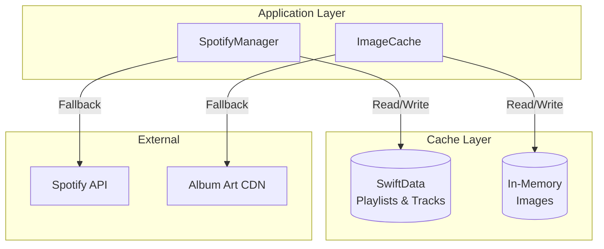
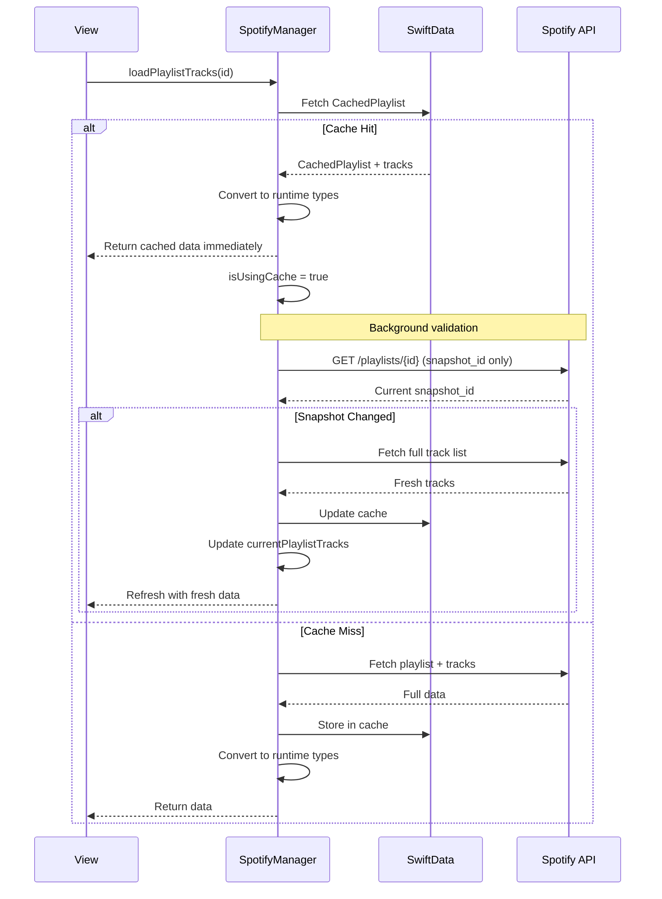
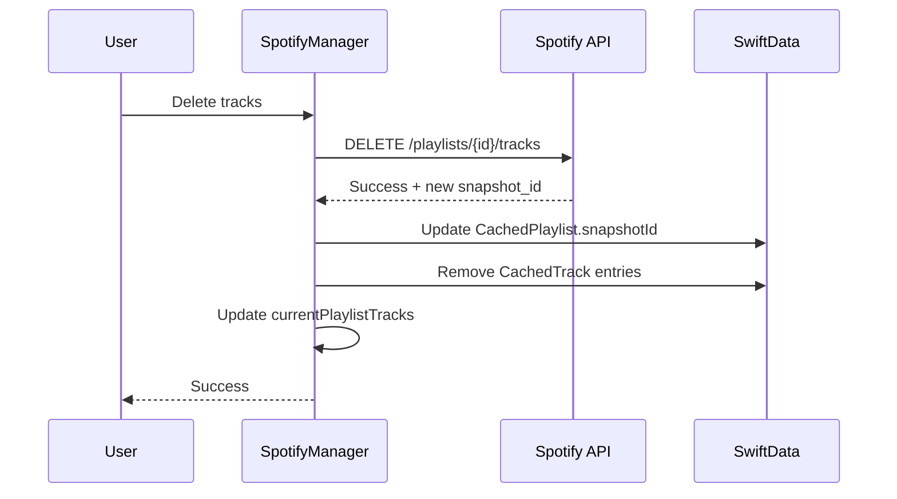
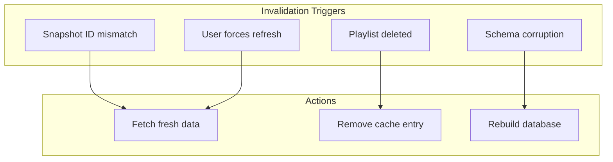
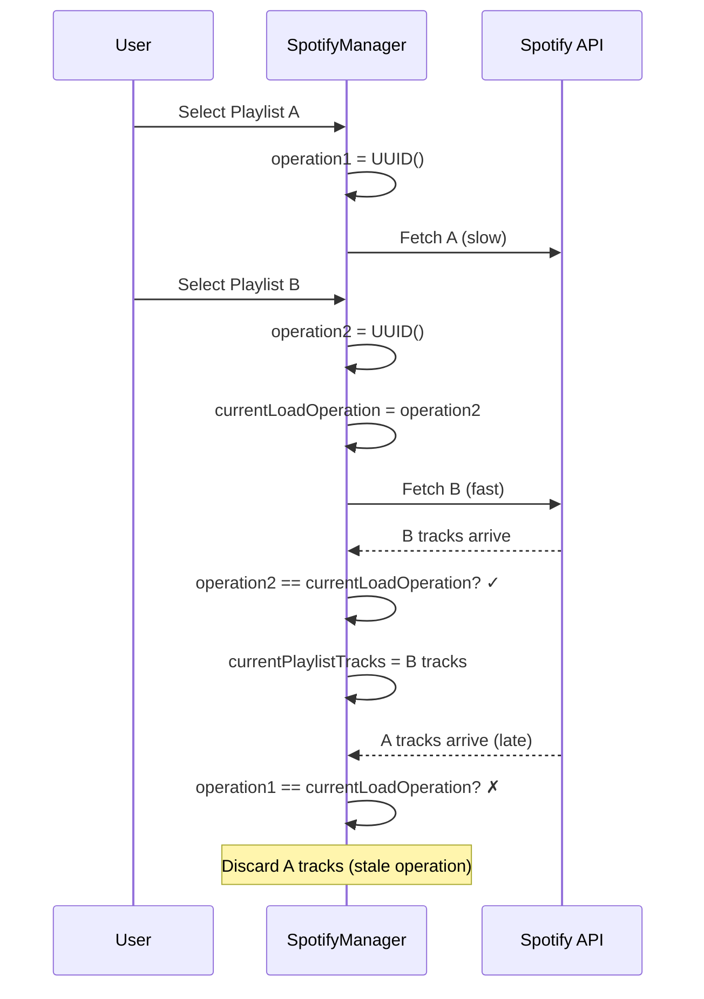
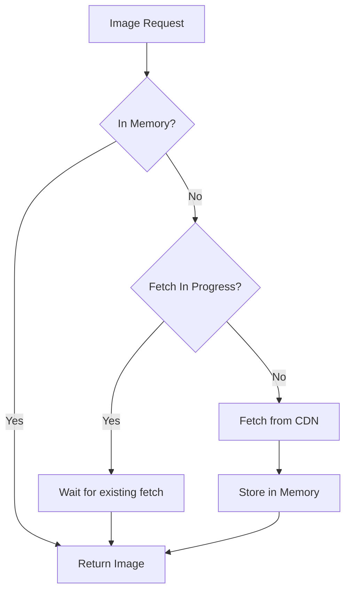

# Caching Strategy

This document details Timor's caching architecture, including SwiftData persistence, cache invalidation, and performance optimizations.

## Cache Architecture



## SwiftData Cache

### Schema

```swift
let schema = Schema([
    CachedPlaylist.self,   // Playlist metadata
    CachedTrack.self,      // Track data with positions
    PlaylistFolder.self    // Local folder organization
])

let config = ModelConfiguration(
    schema: schema,
    url: URL.applicationSupportDirectory.appending(path: "SpotifyCache.store"),
    allowsSave: true,
    cloudKitDatabase: .none  // Local only, no sync
)
```

### Cache Storage Location

```
~/Library/Containers/xsf.welshofer.Timor/Data/Library/Application Support/
├── SpotifyCache.store     # SQLite database
├── SpotifyCache.store-shm # Shared memory file
└── SpotifyCache.store-wal # Write-ahead log
```

## Cache Flow

### Read-Through Pattern



### Write-Through Pattern



## Cache Invalidation

### Snapshot ID Validation

Spotify provides a `snapshot_id` that changes whenever a playlist is modified:

```swift
struct CachedPlaylist {
    var snapshotId: String?  // Spotify's version identifier
}

func validateCache(playlistId: String) async -> Bool {
    guard let cached = loadCachedPlaylist(playlistId),
          let cachedSnapshot = cached.snapshotId else {
        return false
    }

    // Fetch current snapshot from API
    guard let apiSnapshot = await api.fetchPlaylistSnapshot(playlistId) else {
        return false
    }

    return cachedSnapshot == apiSnapshot
}
```

### Invalidation Triggers



### Track Count Validation

As an additional safety check, Timor validates track counts:

```swift
let cachedCount = cached.tracks?.count ?? 0
let apiCount = apiPlaylist.totalTracks
let difference = abs(cachedCount - apiCount)

if difference > Constants.Validation.trackCountDifferenceThreshold {
    logger.warning("Track count mismatch: cached \(cachedCount) vs API \(apiCount)")
    // Consider cache stale, fetch fresh
}
```

## Cache Safety

### Empty Data Protection

Never overwrite good cache with empty data:

```swift
func cachePlaylistTracks(_ playlistId: String, tracks: [Track]) {
    // CRITICAL: Never cache empty results
    guard !tracks.isEmpty else {
        logger.warning("Refusing to cache empty track list for \(playlistId)")
        return
    }

    // Proceed with caching...
}
```

### Atomic Operations

Operations use unique IDs to prevent race conditions:

```swift
private struct PlaylistLoadOperation: Equatable {
    let id: UUID              // Unique operation ID
    let playlistId: String    // Playlist being loaded
    let startTime: Date       // For debugging
}

func loadPlaylistTracks(_ playlistId: String) async {
    let operation = PlaylistLoadOperation(
        id: UUID(),
        playlistId: playlistId,
        startTime: Date()
    )
    currentLoadOperation = operation

    // ... fetch tracks ...

    // Verify operation is still valid before updating state
    guard currentLoadOperation?.id == operation.id else {
        logger.debug("Operation superseded, discarding results")
        return
    }

    currentPlaylistTracks = fetchedTracks
}
```

### Race Condition Prevention



## Cache Recovery

### Schema Corruption Handling

```swift
private func setupModelContainer() {
    do {
        modelContainer = try ModelContainer(for: schema, configurations: [config])
        modelContext = modelContainer?.mainContext
    } catch {
        logger.error("ModelContainer failed: \(error)")
        modelContainerFailed = true
        retryModelContainerSetup()
    }
}

private func retryModelContainerSetup() {
    logger.info("Attempting ModelContainer recovery...")

    // Delete corrupted store files
    let url = URL.applicationSupportDirectory.appending(path: Constants.Cache.cacheStoreFileName)
    try? FileManager.default.removeItem(at: url)
    try? FileManager.default.removeItem(at: url.appendingPathExtension("shm"))
    try? FileManager.default.removeItem(at: url.appendingPathExtension("wal"))

    // Retry with fresh database
    do {
        modelContainer = try ModelContainer(for: schema, configurations: [config])
        modelContext = modelContainer?.mainContext
        modelContainerFailed = false
        logger.info("ModelContainer recovery successful")
    } catch {
        logger.error("Recovery failed: \(error)")
        // Continue without caching - app still works, just slower
        displayError(.cacheUnavailable)
    }
}
```

## Image Caching

### ImageCache Actor

```swift
actor ImageCache {
    static let shared = ImageCache()

    private var cache: [URL: Image] = [:]
    private var inFlight: [URL: Task<Image?, Never>] = [:]

    func image(for url: URL) async -> Image? {
        // Check memory cache
        if let cached = cache[url] {
            return cached
        }

        // Check if already fetching
        if let task = inFlight[url] {
            return await task.value
        }

        // Fetch and cache
        let task = Task<Image?, Never> {
            guard let (data, _) = try? await URLSession.shared.data(from: url),
                  let platformImage = PlatformImage(data: data) else {
                return nil
            }

            let image = Image(platformImage: platformImage)
            cache[url] = image
            return image
        }

        inFlight[url] = task
        let result = await task.value
        inFlight[url] = nil

        return result
    }

    func prefetch(urls: [URL]) async {
        await withTaskGroup(of: Void.self) { group in
            for url in urls {
                group.addTask {
                    _ = await self.image(for: url)
                }
            }
        }
    }

    func clear() {
        cache.removeAll()
    }
}
```

### Image Cache Flow



## Performance Optimizations

### Batch Fetching

```swift
// Fetch tracks in parallel batches
func fetchAllPlaylistTracks(_ playlistId: String) async -> [Track] {
    let total = playlist.totalTracks
    let batchSize = Constants.Spotify.trackFetchLimit  // 100

    return await withTaskGroup(of: (Int, [Track]).self) { group in
        // Limit to 5 concurrent requests
        for offset in stride(from: 0, to: total, by: batchSize) {
            group.addTask {
                let tracks = await self.fetchTrackBatch(playlistId, offset: offset)
                return (offset, tracks)
            }
        }

        var allTracks: [Track] = []
        for await (_, tracks) in group {
            allTracks.append(contentsOf: tracks)
        }

        return allTracks.sorted { /* by position */ }
    }
}
```

### Cache-First UI

```swift
func loadPlaylistTracks(_ playlistId: String) async {
    // Immediately show cached data
    if let cached = loadCachedPlaylist(playlistId) {
        currentPlaylistTracks = cached.tracks?.map { $0.toTrack() } ?? []
        isUsingCache = true
    }

    // Then validate/refresh in background
    let needsRefresh = await !validateCache(playlistId)
    if needsRefresh {
        let fresh = await fetchFreshTracks(playlistId)
        currentPlaylistTracks = fresh
        isUsingCache = false
    }
}
```

## Cache Statistics

### Tracking Cache Effectiveness

```swift
@Published var lastCacheUpdate: Date?
@Published var isUsingCache = false

// UI can show cache status
Text(spotifyManager.isUsingCache ? "Cached" : "Live")
    .foregroundStyle(.secondary)

if let lastUpdate = spotifyManager.lastCacheUpdate {
    Text("Updated \(lastUpdate, style: .relative) ago")
}
```

## Cache Limits

| Resource | Strategy | Limit |
|----------|----------|-------|
| Playlists | Persist all | Unlimited |
| Tracks | Persist all | Unlimited |
| Images | Memory only | ~100 MB |
| Folders | Persist all | Unlimited |

### Memory Pressure Handling

```swift
// ImageCache responds to memory warnings
NotificationCenter.default.addObserver(
    forName: UIApplication.didReceiveMemoryWarningNotification,
    object: nil,
    queue: .main
) { [weak self] _ in
    Task {
        await self?.imageCache.clear()
    }
}
```

## Debugging Cache

### Viewing Cache Contents

```bash
# SQLite inspection
sqlite3 ~/Library/Containers/xsf.welshofer.Timor/Data/Library/Application\ Support/SpotifyCache.store

sqlite> .tables
ZCACHEDPLAYLIST  ZCACHEDTRACK  ZPLAYLISTFOLDER

sqlite> SELECT ZPLAYLISTID, ZNAME, ZTOTALTRACKS FROM ZCACHEDPLAYLIST;
```

### Clearing Cache

```bash
# Delete cache files (app must be closed)
rm -rf ~/Library/Containers/xsf.welshofer.Timor/Data/Library/Application\ Support/SpotifyCache.store*
```

### Logging

```swift
private static let logger = Logger(subsystem: "com.timor.spotify", category: "SpotifyManager")

// Cache hit
logger.debug("Cache hit for playlist \(playlistId, privacy: .public)")

// Cache miss
logger.info("Cache miss for playlist \(playlistId, privacy: .public), fetching from API")

// Validation
logger.info("Snapshot changed, refreshing cache")
```
