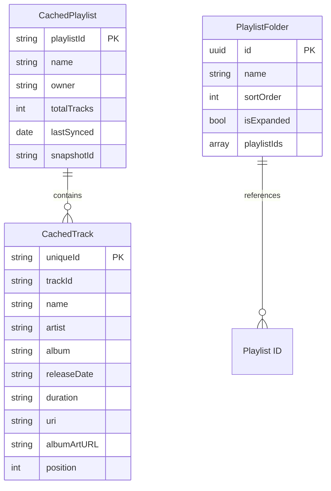
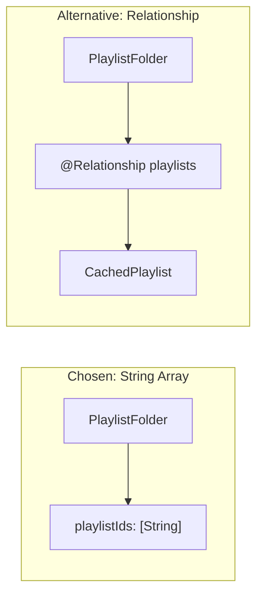
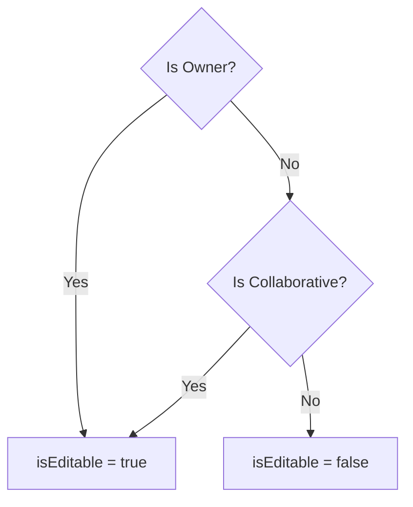
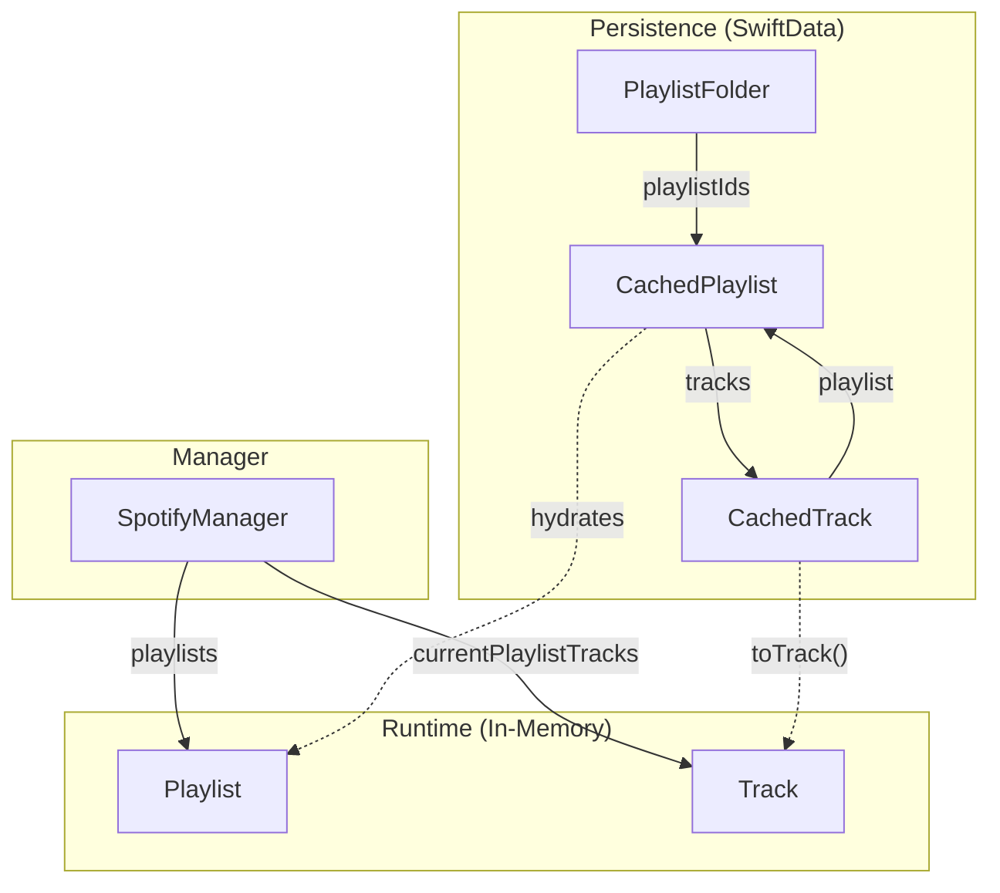
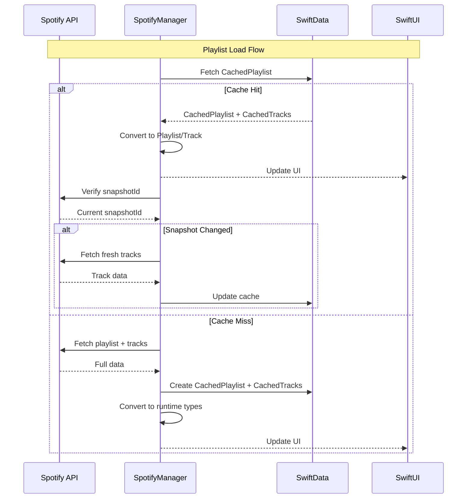

# Data Models

This document describes all data models used in Timor, including SwiftData persistence models and runtime structs.

## Model Overview



## SwiftData Models

### CachedPlaylist

Persists Spotify playlist metadata locally for offline access and reduced API calls.

```swift
@Model
final class CachedPlaylist {
    @Attribute(.unique) var playlistId: String  // Spotify ID
    var name: String
    var owner: String
    var totalTracks: Int
    var lastSynced: Date
    var snapshotId: String?  // For change detection

    @Relationship(deleteRule: .cascade, inverse: \CachedTrack.playlist)
    var tracks: [CachedTrack]?
}
```

#### Attributes

| Attribute | Type | Constraints | Description |
|-----------|------|-------------|-------------|
| `playlistId` | `String` | `@Attribute(.unique)` | Spotify's playlist ID |
| `name` | `String` | Required | Display name |
| `owner` | `String` | Required | Owner's display name |
| `totalTracks` | `Int` | Required | Track count from Spotify |
| `lastSynced` | `Date` | Required | Last sync timestamp |
| `snapshotId` | `String?` | Optional | Spotify's version identifier |
| `tracks` | `[CachedTrack]?` | Cascade delete | Related tracks |

#### Usage Patterns

```swift
// Fetch cached playlist
let descriptor = FetchDescriptor<CachedPlaylist>(
    predicate: #Predicate { $0.playlistId == targetId }
)
let cached = try modelContext.fetch(descriptor).first

// Check if cache is stale
let isStale = cached.snapshotId != remoteSnapshotId
```

### CachedTrack

Persists individual track data with position information for ordered retrieval.

```swift
@Model
final class CachedTrack {
    var trackId: String                    // Spotify track ID
    @Attribute(.unique) var uniqueId: String  // trackId + position combo
    var name: String
    var artist: String
    var album: String
    var releaseDate: String
    var duration: String
    var uri: String
    var albumArtURL: String?
    var position: Int                      // Order in playlist

    var playlist: CachedPlaylist?          // Parent relationship
}
```

#### Why `uniqueId`?

Playlists can contain duplicate tracks. The `uniqueId` combines `trackId` with `position` to create a unique identifier:

```swift
// A track appearing twice in a playlist
uniqueId = "spotify:track:abc123_0"  // Position 0
uniqueId = "spotify:track:abc123_5"  // Position 5
```

#### Conversion to Runtime Type

```swift
func toTrack() -> SpotifyManager.Track {
    SpotifyManager.Track(
        id: uniqueId,
        trackId: trackId,
        name: name,
        artist: artist,
        album: album,
        releaseDate: releaseDate,
        duration: duration,
        uri: uri,
        albumArtURL: albumArtURL,
        isLiked: false  // Updated via API check
    )
}
```

### PlaylistFolder

Local-only organization structure. Spotify's API doesn't support folders, so these are purely client-side.

```swift
@Model
final class PlaylistFolder {
    @Attribute(.unique) var id: UUID
    var name: String
    var sortOrder: Int
    var isExpanded: Bool
    var playlistIds: [String]  // References, not relationships

    func addPlaylist(_ playlistId: String)
    func removePlaylist(_ playlistId: String)
    func containsPlaylist(_ playlistId: String) -> Bool
}
```

#### Design Decision: String Array vs Relationship



**Why String Array?**
- `Playlist` is a runtime struct from SpotifyManager, not a SwiftData model
- Folders reference Spotify playlist IDs that may or may not be cached
- Simpler schema, no join table needed
- Folders persist even if cache is cleared

## Runtime Models

### SpotifyManager.Playlist

In-memory representation of a Spotify playlist. Not persisted directly (cached version is `CachedPlaylist`).

```swift
struct Playlist: Identifiable {
    let id: String           // Spotify playlist ID
    let name: String
    let totalTracks: Int
    let owner: String
    let description: String?
    let isEditable: Bool     // Can current user modify?
}
```

#### Editability Rules



### SpotifyManager.Track

Runtime track representation with Transferable conformance for drag & drop.

```swift
struct Track: Identifiable, Hashable, Codable, Transferable {
    let id: String           // Unique ID (trackId + position)
    let trackId: String      // Original Spotify track ID
    let name: String
    let artist: String
    let album: String
    let releaseDate: String
    let duration: String     // Formatted: "3:45"
    let uri: String          // spotify:track:xxx
    let albumArtURL: String?
    var isLiked: Bool        // Mutable for UI updates

    static var transferRepresentation: some TransferRepresentation {
        CodableRepresentation(contentType: .spotifyTrack)
    }
}
```

#### Protocol Conformances

| Protocol | Purpose |
|----------|---------|
| `Identifiable` | SwiftUI List/ForEach identification |
| `Hashable` | Set membership for multi-selection |
| `Codable` | Serialization for drag & drop |
| `Transferable` | macOS/iOS drag & drop support |

#### Custom UTType

```swift
extension UTType {
    static var spotifyTrack: UTType {
        UTType(exportedAs: "xsf.welshofer.Timor.spotifytrack")
    }
}
```

### ConnectionType

Network connectivity state enum.

```swift
enum ConnectionType {
    case unknown
    case wifi
    case cellular
    case wired
    case other

    var description: String { ... }
}
```

## Model Relationships



## Data Lifecycle



## Schema Migrations

SwiftData handles lightweight migrations automatically. For breaking changes:

```swift
// In SpotifyManager.setupModelContainer()
let schema = Schema([
    CachedPlaylist.self,
    CachedTrack.self,
    PlaylistFolder.self
])

let config = ModelConfiguration(
    schema: schema,
    url: cacheURL,
    allowsSave: true,
    cloudKitDatabase: .none  // Local only
)

modelContainer = try ModelContainer(for: schema, configurations: [config])
```

### Recovery on Corruption

If the schema fails to load, Timor attempts recovery:

```swift
// Delete corrupted store files
try? FileManager.default.removeItem(at: url)
try? FileManager.default.removeItem(at: url.appendingPathExtension("shm"))
try? FileManager.default.removeItem(at: url.appendingPathExtension("wal"))

// Retry with fresh database
modelContainer = try ModelContainer(for: schema, configurations: [config])
```

## Indexing Strategy

| Model | Indexed Attributes | Query Pattern |
|-------|-------------------|---------------|
| `CachedPlaylist` | `playlistId` (unique) | Lookup by ID |
| `CachedTrack` | `uniqueId` (unique) | Lookup by ID |
| `CachedTrack` | `position` | Sorted retrieval |
| `PlaylistFolder` | `id` (unique) | Lookup by ID |
| `PlaylistFolder` | `sortOrder` | Ordered listing |

## Validation Rules

### Track Count Validation

```swift
// Warn if cached count differs significantly from API
let difference = abs(cachedPlaylist.tracks?.count ?? 0 - apiPlaylist.totalTracks)
if difference > Constants.Validation.trackCountDifferenceThreshold {
    Self.logger.warning("Track count mismatch: cached \(cachedCount) vs API \(apiCount)")
}
```

### Empty Data Protection

```swift
// Never overwrite cache with empty data
guard !fetchedTracks.isEmpty else {
    Self.logger.warning("Refusing to cache empty track list")
    return
}
```
