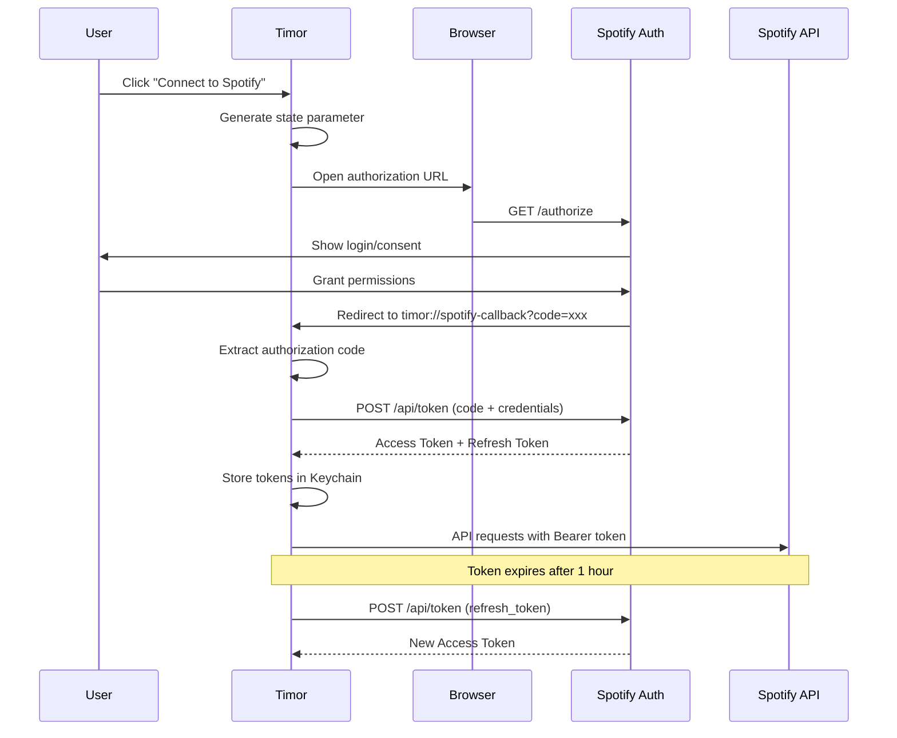
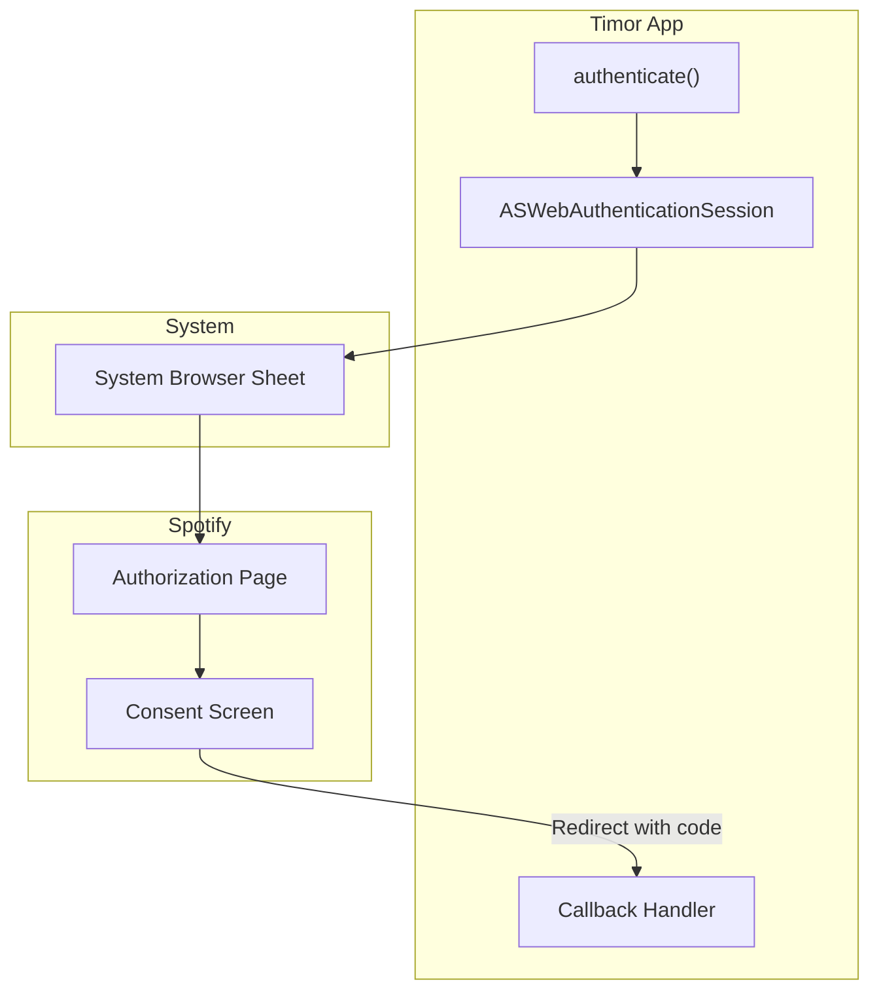
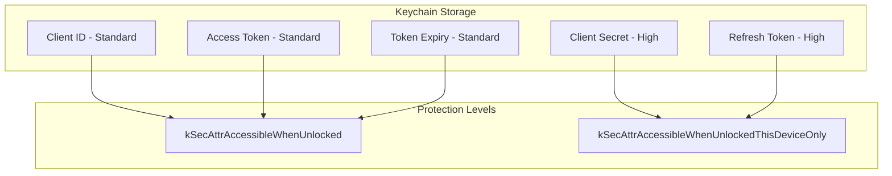
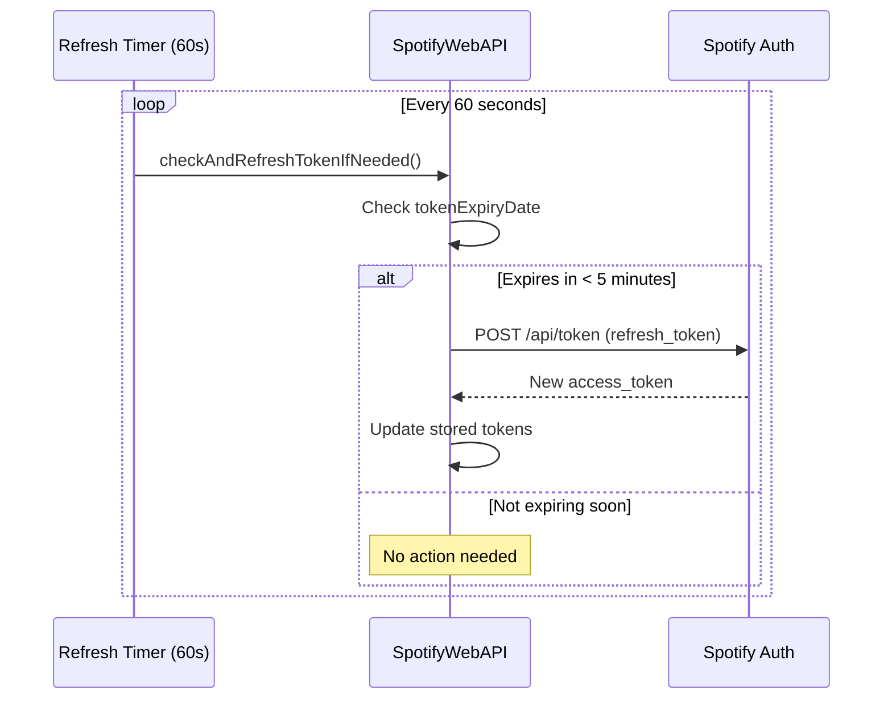
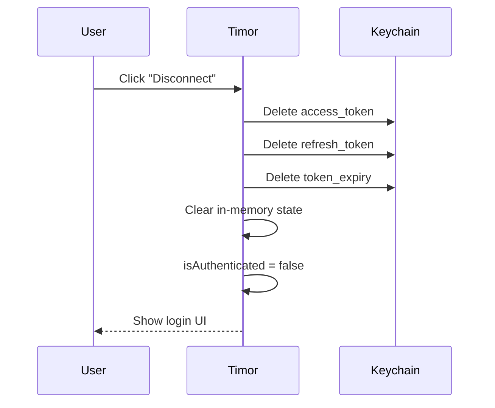
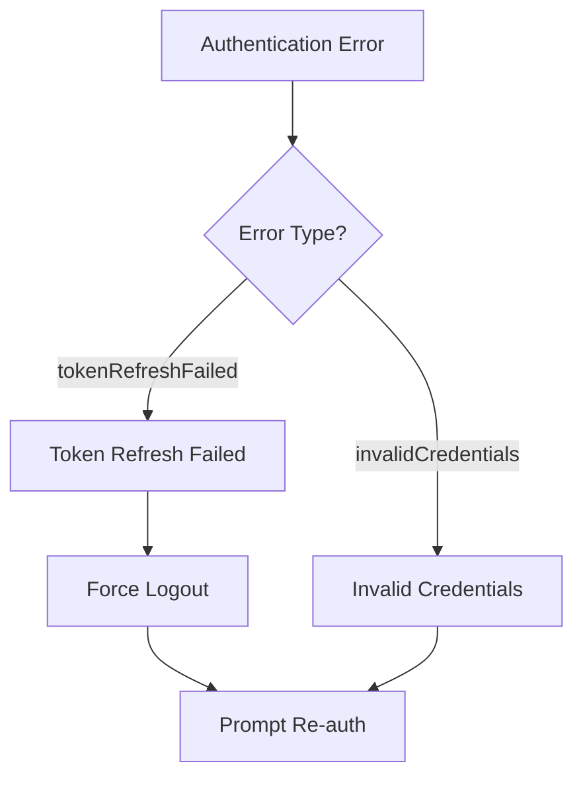

# OAuth 2.0 Authentication Flow

This document details Timor's implementation of Spotify's OAuth 2.0 Authorization Code Flow.

## Flow Overview



## Configuration

### Spotify Developer Setup

1. Create app at [developer.spotify.com/dashboard](https://developer.spotify.com/dashboard)
2. Configure redirect URI: `timor://spotify-callback`
3. Note Client ID and Client Secret

### App Configuration (Constants.swift)

```swift
enum Constants {
    enum Spotify {
        static let redirectURI = "timor://spotify-callback"
        static let authURL = "https://accounts.spotify.com/authorize"
        static let tokenURL = "https://accounts.spotify.com/api/token"
        static let scopes = """
            playlist-read-private
            playlist-read-collaborative
            playlist-modify-public
            playlist-modify-private
            user-read-private
            user-library-read
            user-library-modify
            """
    }
}
```

### Required Scopes

| Scope | Purpose |
|-------|---------|
| `playlist-read-private` | Read user's private playlists |
| `playlist-read-collaborative` | Read collaborative playlists |
| `playlist-modify-public` | Edit public playlists |
| `playlist-modify-private` | Edit private playlists |
| `user-read-private` | Get user profile info |
| `user-library-read` | Read Liked Songs |
| `user-library-modify` | Like/unlike tracks |

## Authorization Request

### URL Construction

```swift
func authenticate() {
    let state = UUID().uuidString  // CSRF protection

    var components = URLComponents(string: authURL)!
    components.queryItems = [
        URLQueryItem(name: "client_id", value: clientID),
        URLQueryItem(name: "response_type", value: "code"),
        URLQueryItem(name: "redirect_uri", value: redirectURI),
        URLQueryItem(name: "scope", value: scopes),
        URLQueryItem(name: "state", value: state)
    ]

    // Use ASWebAuthenticationSession for secure OAuth
    authSession = ASWebAuthenticationSession(
        url: components.url!,
        callbackURLScheme: "timor"
    ) { callbackURL, error in
        // Handle callback
    }
    authSession?.start()
}
```

### ASWebAuthenticationSession Flow



## Token Exchange

### Exchange Code for Tokens

```swift
private func exchangeCodeForTokens(code: String) async {
    guard let authHeader = createBasicAuthHeader() else { return }

    var request = URLRequest(url: URL(string: tokenURL)!)
    request.httpMethod = "POST"
    request.setValue(authHeader, forHTTPHeaderField: "Authorization")
    request.setValue("application/x-www-form-urlencoded", forHTTPHeaderField: "Content-Type")

    let body = [
        "grant_type": "authorization_code",
        "code": code,
        "redirect_uri": redirectURI
    ]
    request.httpBody = body.urlEncodedString.data(using: .utf8)

    let (data, _) = try await URLSession.shared.data(for: request)
    let response = try JSONDecoder().decode(TokenResponse.self, from: data)

    saveTokens(
        accessToken: response.accessToken,
        refreshToken: response.refreshToken,
        expiresIn: response.expiresIn
    )
}
```

### Token Response

```swift
struct TokenResponse: Codable {
    let accessToken: String      // Bearer token for API
    let tokenType: String        // "Bearer"
    let expiresIn: Int           // Seconds (typically 3600)
    let refreshToken: String?    // For obtaining new access tokens
    let scope: String            // Granted scopes
}
```

## Token Storage

### Keychain Security



### Storage Implementation

```swift
func saveTokens(accessToken: String, refreshToken: String?, expiresIn: Int?) {
    // Store access token
    try? keychain.save(accessToken, for: Constants.Keychain.accessTokenKey)

    // Store refresh token with high protection
    if let refreshToken = refreshToken {
        try? keychain.save(
            refreshToken,
            for: Constants.Keychain.refreshTokenKey,
            protection: .high
        )
    }

    // Store expiry timestamp
    if let expiresIn = expiresIn {
        let expiryDate = Date().addingTimeInterval(TimeInterval(expiresIn))
        tokenExpiryDate = expiryDate
        try? keychain.save(
            String(expiryDate.timeIntervalSince1970),
            for: "spotify_token_expiry"
        )
    }

    isAuthenticated = true
}
```

## Token Refresh

### Proactive Refresh Strategy



### Refresh Implementation

```swift
private func setupTokenRefreshTimer() {
    tokenRefreshTimer = Timer.scheduledTimer(withTimeInterval: 60, repeats: true) { _ in
        Task { @MainActor in
            await self.checkAndRefreshTokenIfNeeded()
        }
    }
}

private func checkAndRefreshTokenIfNeeded() async {
    guard let expiryDate = tokenExpiryDate else { return }

    // Refresh if token expires in less than 5 minutes
    let fiveMinutesFromNow = Date().addingTimeInterval(5 * 60)
    if expiryDate < fiveMinutesFromNow && refreshToken != nil {
        _ = await refreshAccessToken()
    }
}

func refreshAccessToken() async -> Bool {
    guard let refreshToken = refreshToken,
          let authHeader = createBasicAuthHeader() else {
        return false
    }

    var request = URLRequest(url: URL(string: tokenURL)!)
    request.httpMethod = "POST"
    request.setValue(authHeader, forHTTPHeaderField: "Authorization")
    request.setValue("application/x-www-form-urlencoded", forHTTPHeaderField: "Content-Type")

    let body = "grant_type=refresh_token&refresh_token=\(refreshToken)"
    request.httpBody = body.data(using: .utf8)

    do {
        let (data, _) = try await URLSession.shared.data(for: request)
        let response = try JSONDecoder().decode(TokenResponse.self, from: data)

        saveTokens(
            accessToken: response.accessToken,
            refreshToken: response.refreshToken ?? refreshToken,
            expiresIn: response.expiresIn
        )
        return true
    } catch {
        return false
    }
}
```

## Logout Flow



```swift
func logout() {
    accessToken = nil
    refreshToken = nil
    tokenExpiryDate = nil
    isAuthenticated = false
    currentUserId = nil

    try? keychain.delete(for: Constants.Keychain.accessTokenKey)
    try? keychain.delete(for: Constants.Keychain.refreshTokenKey)
    try? keychain.delete(for: "spotify_token_expiry")

    // Note: Client ID and Secret are preserved
}
```

## Credential Security

### Basic Auth Header Construction

```swift
/// Creates Basic Auth header with minimal secret exposure
private func createBasicAuthHeader() -> String? {
    guard let clientIdData = clientID.data(using: .utf8),
          let secretData = getClientSecretData() else {
        return nil
    }

    // Combine credentials
    var credentials = clientIdData
    credentials.append(":".data(using: .utf8)!)
    credentials.append(secretData)

    let base64 = credentials.base64EncodedString()

    // Clear sensitive data from memory
    credentials.resetBytes(in: 0..<credentials.count)

    return "Basic \(base64)"
}
```

### Security Practices

| Practice | Implementation |
|----------|----------------|
| No hardcoded secrets | User provides via Settings UI |
| Keychain storage | macOS Keychain with access control |
| Minimal exposure | Secrets loaded only when needed |
| Memory clearing | `resetBytes` after use |
| Device binding | Refresh token: ThisDeviceOnly |
| CSRF protection | Random state parameter |

## Error Handling

### Authentication Errors

```swift
enum SpotifyError {
    case notAuthenticated
    case authenticationFailed(reason: String)
    case tokenRefreshFailed
    case invalidCredentials
}
```

### Error Recovery



## Startup Validation

```swift
private func loadTokens() {
    accessToken = try? keychain.retrieve(for: "spotify_web_access_token")
    refreshToken = try? keychain.retrieve(for: "spotify_web_refresh_token")

    // Load token expiry
    if let expiryString = try? keychain.retrieve(for: "spotify_token_expiry"),
       let expiryInterval = TimeInterval(expiryString) {
        tokenExpiryDate = Date(timeIntervalSince1970: expiryInterval)
    }

    isAuthenticated = accessToken != nil

    // Validate tokens on startup
    if accessToken != nil || refreshToken != nil {
        Task {
            await validateAndRefreshTokenIfNeeded()
        }
    }
}
```

## URL Scheme Registration

### Info.plist Configuration

```xml
<key>CFBundleURLTypes</key>
<array>
    <dict>
        <key>CFBundleURLSchemes</key>
        <array>
            <string>timor</string>
        </array>
        <key>CFBundleURLName</key>
        <string>Spotify OAuth Callback</string>
    </dict>
</array>
```

### Callback Handling

The app receives callbacks at `timor://spotify-callback?code=xxx&state=yyy`:

```swift
// ASWebAuthenticationSession handles this automatically
authSession = ASWebAuthenticationSession(
    url: authURL,
    callbackURLScheme: "timor"  // Matches CFBundleURLSchemes
) { callbackURL, error in
    guard let code = extractCode(from: callbackURL) else { return }
    await exchangeCodeForTokens(code: code)
}
```
