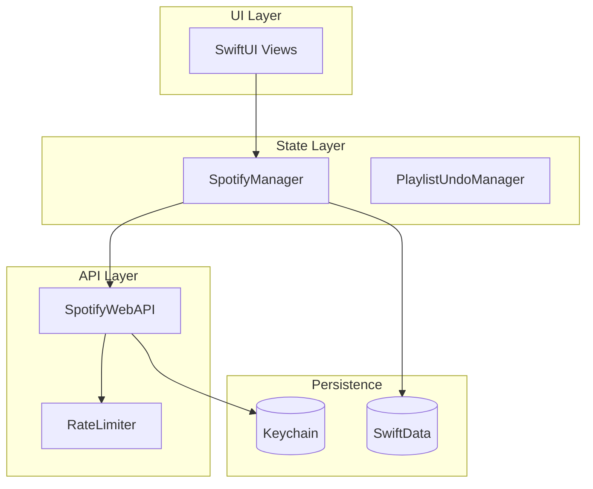

# Timor Documentation

Welcome to the Timor technical documentation. This documentation provides comprehensive coverage of the architecture, implementation details, and design decisions behind the Timor Spotify playlist manager.

## Quick Links

| Document | Description |
|----------|-------------|
| [Architecture](ARCHITECTURE.md) | System overview, component interactions, threading model |
| [Data Models](DATA-MODELS.md) | SwiftData schemas, runtime types, relationships |
| [OAuth Flow](OAUTH-FLOW.md) | Authentication sequence, token management |
| [API Reference](API-REFERENCE.md) | Complete API documentation for all public types |
| [State Management](STATE-MANAGEMENT.md) | Observable patterns, view bindings, state flow |
| [Caching](CACHING.md) | Cache strategy, invalidation, performance |
| [Security](SECURITY.md) | Credential storage, certificate pinning, threat model |

## Architecture at a Glance



## Key Concepts

### Single Source of Truth

All application state flows through `SpotifyManager`, which:
- Coordinates API calls via `SpotifyWebAPI`
- Manages local cache via SwiftData
- Provides `@Published` properties for SwiftUI bindings
- Handles undo/redo via `PlaylistUndoManager`

### Cache-First Architecture

Timor uses an aggressive caching strategy:
1. **Immediate display** — Show cached data instantly
2. **Background validation** — Verify cache via Spotify's snapshot ID
3. **Selective refresh** — Only fetch when cache is stale
4. **Result**: ~80% reduction in API calls

### Platform Abstraction

Cross-platform support via compile-time conditionals:
- `TrackTableView` (macOS) vs `TrackListView` (iOS)
- Native dialogs per platform
- Shared business logic (~90%)

## Reading Order

For new contributors, we recommend:

1. **[Architecture](ARCHITECTURE.md)** — Understand the big picture
2. **[Data Models](DATA-MODELS.md)** — Learn the data structures
3. **[State Management](STATE-MANAGEMENT.md)** — Understand reactive patterns
4. **[OAuth Flow](OAUTH-FLOW.md)** — Authentication deep dive
5. **[API Reference](API-REFERENCE.md)** — Complete API coverage
6. **[Caching](CACHING.md)** — Performance optimizations
7. **[Security](SECURITY.md)** — Security measures

## Diagrams

All documentation uses [Mermaid](https://mermaid.js.org/) diagrams. To view them:

- **GitHub** — Renders automatically
- **VS Code** — Install "Markdown Preview Mermaid Support" extension
- **Xcode** — Use a Markdown preview extension or view on GitHub

## Document Structure

Each document follows a consistent structure:

```
# Title

Overview paragraph

## Concept Overview (with Mermaid diagram)

## Implementation Details

### Subsection with code examples

## Best Practices / Considerations

## Related Documents
```

## Keeping Docs Updated

When modifying code:

1. Check if changes affect documented behavior
2. Update relevant diagrams in architecture docs
3. Update API reference for signature changes
4. Add notes about breaking changes

## Project Links

- [Main README](../README.md) — User-facing documentation
- [CLAUDE.md](../CLAUDE.md) — AI assistant context
- [LICENSE](../LICENSE) — MIT License
