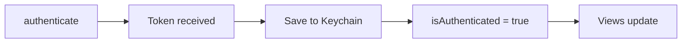
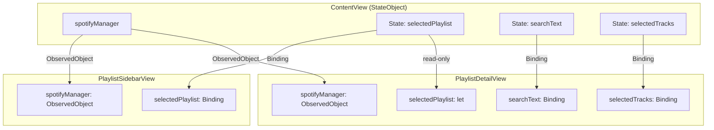
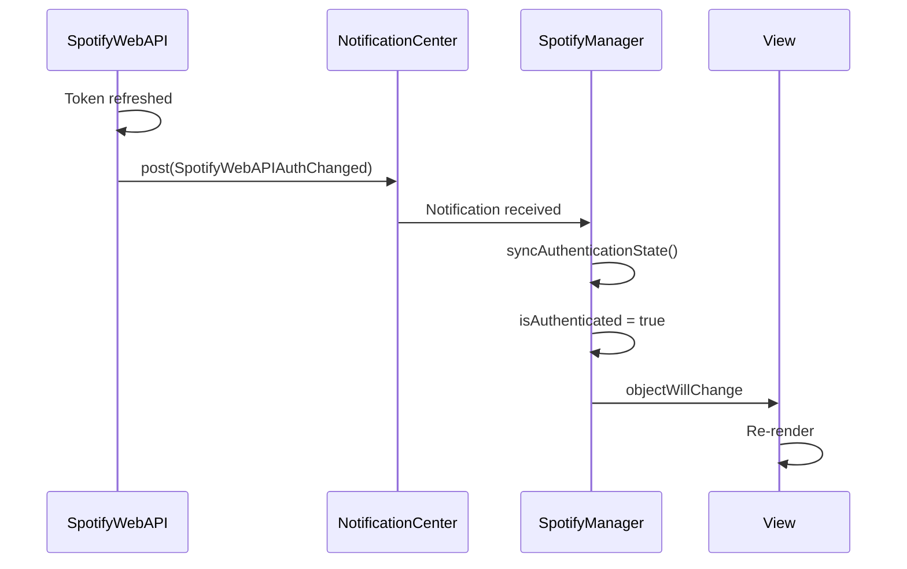
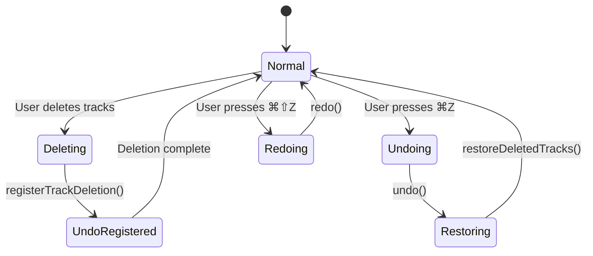
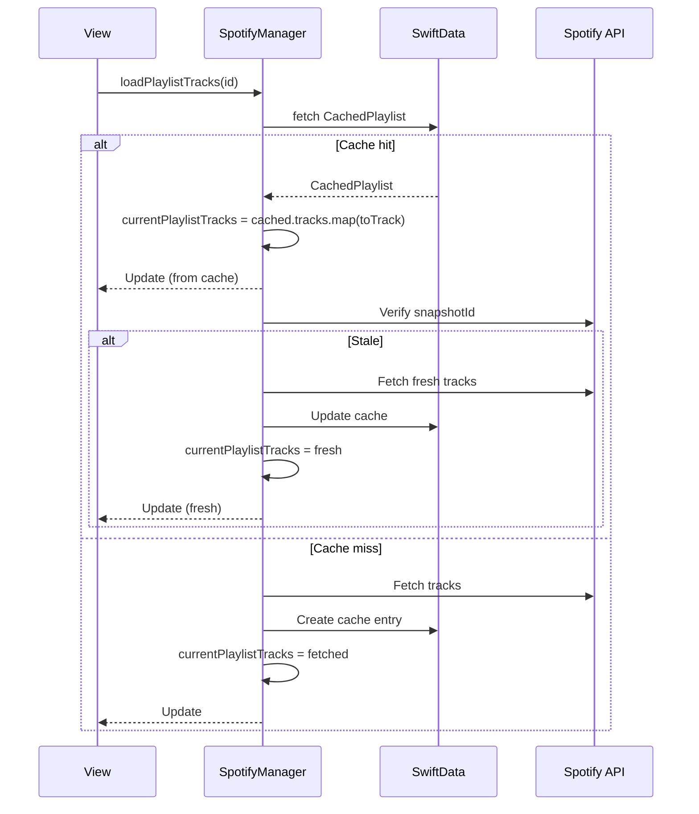

# State Management

This document explains Timor's state management architecture using SwiftUI's observation patterns and Combine framework.

## Architecture Overview

```mermaid
graph TB
    subgraph "Observable Objects"
        SM["SpotifyManager (StateObject)"]
        SWAPI["SpotifyWebAPI (Published)"]
        PUM["PlaylistUndoManager (Published)"]
    end

    subgraph "View State"
        CS["State variables"]
        CB["Binding props"]
    end

    subgraph "Persistence"
        SD[SwiftData]
        KC[Keychain]
    end

    subgraph "Views"
        CV[ContentView]
        PSV[PlaylistSidebarView]
        PDV[PlaylistDetailView]
    end

    CV -->|@StateObject| SM
    CV -->|@Binding| PSV
    CV -->|@Binding| PDV

    SM -->|observes| SWAPI
    SM -->|owns| PUM
    SM -->|persists| SD
    SWAPI -->|persists| KC
```

## ObservableObject Pattern

### SpotifyManager as Central Store

SpotifyManager is the single source of truth for application state:

```swift
@MainActor
class SpotifyManager: ObservableObject {
    static let shared = SpotifyManager()

    // MARK: - Published Properties

    @Published var isAuthenticated = false
    @Published var playlists: [Playlist] = []
    @Published var currentPlaylistTracks: [Track] = []
    @Published var isLoadingTracks = false
    @Published var loadingProgress: (current: Int, total: Int) = (0, 0)
    @Published var lastError: String?
    @Published var showError = false
    // ... more @Published properties
}
```

### View Consumption

```swift
struct ContentView: View {
    @StateObject private var spotifyManager = SpotifyManager.shared

    var body: some View {
        NavigationSplitView {
            PlaylistSidebarView(spotifyManager: spotifyManager, ...)
        } detail: {
            PlaylistDetailView(spotifyManager: spotifyManager, ...)
        }
    }
}
```

## State Flow Diagram

```mermaid
sequenceDiagram
    participant User
    participant View
    participant SpotifyManager
    participant @Published
    participant SwiftUI

    User->>View: Tap playlist
    View->>SpotifyManager: loadPlaylistTracks(id)

    SpotifyManager->>@Published: isLoadingTracks = true
    @Published->>SwiftUI: objectWillChange.send()
    SwiftUI->>View: Re-render with loading state

    SpotifyManager->>SpotifyManager: Fetch tracks async
    SpotifyManager->>@Published: currentPlaylistTracks = [...]
    SpotifyManager->>@Published: isLoadingTracks = false

    @Published->>SwiftUI: objectWillChange.send()
    SwiftUI->>View: Re-render with tracks
    View-->>User: Display track list
```

## @Published Properties by Category

### Authentication State

```swift
@Published var isAuthenticated = false      // Main auth flag
@Published var hasCredentials = false       // Credentials configured?
```

**Update Flow:**


### Playlist State

```swift
@Published var playlists: [Playlist] = []
@Published var selectedPlaylist: Playlist?
@Published var isViewingLikedSongs = false
```

### Track State

```swift
@Published var currentPlaylistTracks: [Track] = []
@Published var currentTrack: String = ""
```

### Loading State

```swift
@Published var isLoadingTracks = false
@Published var loadingProgress: (current: Int, total: Int) = (0, 0)
@Published var isShuffling = false
```

**Progress Reporting:**
```swift
// During bulk track fetch
for (index, batch) in batches.enumerated() {
    loadingProgress = (index * batchSize, totalTracks)
    // ... fetch batch
}
loadingProgress = (totalTracks, totalTracks)
```

### Cache State

```swift
@Published var lastCacheUpdate: Date?
@Published var isUsingCache = false
@Published var modelContainerFailed = false
```

### Network State

```swift
@Published var isOnline = true
@Published var connectionType: ConnectionType = .unknown
```

**Network Monitor Integration:**
```swift
private func setupNetworkMonitor() {
    networkMonitor = NWPathMonitor()
    networkMonitor?.pathUpdateHandler = { [weak self] path in
        DispatchQueue.main.async {
            self?.updateNetworkStatus(path)
        }
    }
    networkMonitor?.start(queue: networkQueue)
}

private func updateNetworkStatus(_ path: NWPath) {
    isOnline = path.status == .satisfied
    // Determine connection type...
}
```

### Error State

```swift
@Published var lastError: String?
@Published var lastErrorRecovery: String?
@Published var showError = false
```

**Error Display Pattern:**
```swift
func displayError(_ error: SpotifyError) {
    lastError = error.localizedDescription
    lastErrorRecovery = error.recoverySuggestion
    showError = true
}

// In View
.alert("Error", isPresented: $spotifyManager.showError) {
    Button("OK") { }
} message: {
    Text(spotifyManager.lastError ?? "Unknown error")
    if let recovery = spotifyManager.lastErrorRecovery {
        Text(recovery)
    }
}
```

## View-Local State

### @State for UI-Only State

```swift
struct PlaylistDetailView: View {
    // UI state (not shared)
    @State private var searchText = ""
    @State private var selectedTracks: Set<Track.ID> = []
    @State private var showDeleteConfirmation = false
    @State private var showTrackSearch = false

    // Shared state from parent
    @ObservedObject var spotifyManager: SpotifyManager
}
```

### @Binding for Parent-Child Communication

```swift
// Parent (ContentView)
@State private var selectedPlaylist: SpotifyManager.Playlist?
@State private var searchText = ""

// Passes binding to child
PlaylistDetailView(
    spotifyManager: spotifyManager,
    selectedPlaylist: selectedPlaylist,  // Read-only
    searchText: $searchText               // Two-way binding
)

// Child receives
struct PlaylistDetailView: View {
    let selectedPlaylist: SpotifyManager.Playlist?
    @Binding var searchText: String
}
```

## State Binding Flow



## Cross-Object Observation

### SpotifyManager observes SpotifyWebAPI

```swift
class SpotifyManager: ObservableObject {
    private func setupWebAPIObserver() {
        authObserverTask = Task { @MainActor in
            for await _ in NotificationCenter.default
                .notifications(named: .init("SpotifyWebAPIAuthChanged")) {
                await syncAuthenticationState()
            }
        }
    }

    private func syncAuthenticationState() async {
        let webAPI = SpotifyWebAPI.shared
        if webAPI.isAuthenticated != isAuthenticated {
            isAuthenticated = webAPI.isAuthenticated
            if isAuthenticated {
                fetchPlaylists()
            }
        }
    }
}
```

### Notification-Based Updates



## Undo State Management

### PlaylistUndoManager Integration

```swift
class SpotifyManager: ObservableObject {
    let playlistUndoManager = PlaylistUndoManager()

    func deleteTracksFromPlaylist(_ playlistId: String, tracks: Set<Track>) async -> Bool {
        // Capture positions for undo
        let trackPositions: [(Track, Int)] = tracks.compactMap { track in
            guard let pos = currentPlaylistTracks.firstIndex(where: { $0.id == track.id }) else {
                return nil
            }
            return (track, pos)
        }

        // Register undo action
        playlistUndoManager.registerTrackDeletion(
            playlistId: playlistId,
            deletedTracks: trackPositions,
            restoreAction: { [weak self] id, tracks in
                await self?.restoreDeletedTracks(playlistId: id, tracks: tracks) ?? false
            }
        )

        // Perform deletion...
    }
}
```

### Undo State Flow



## Selection State

### Multi-Selection Pattern

```swift
struct PlaylistDetailView: View {
    @Binding var selectedTracks: Set<SpotifyManager.Track.ID>

    var body: some View {
        Table(tracks, selection: $selectedTracks) {
            // columns...
        }
        .toolbar {
            Button("Delete") {
                // Use selectedTracks
            }
            .disabled(selectedTracks.isEmpty)
        }
    }
}
```

### Selection State Lifecycle

```mermaid
graph LR
    A[User clicks track] --> B[Add to selectedTracks]
    B --> C{⌘ held?}
    C -->|Yes| D[Add to selection]
    C -->|No| E[Replace selection]

    F[User selects all ⌘A] --> G[selectedTracks = allTrackIds]

    H[Playlist changes] --> I[Clear selectedTracks]
    I --> J[selectedTracks = []]
```

## SwiftData Integration

### ModelContext in SpotifyManager

```swift
class SpotifyManager: ObservableObject {
    private var modelContainer: ModelContainer?
    private var modelContext: ModelContext?

    private func setupModelContainer() {
        let schema = Schema([CachedPlaylist.self, CachedTrack.self, PlaylistFolder.self])
        modelContainer = try? ModelContainer(for: schema)
        modelContext = modelContainer?.mainContext
    }

    // State derived from SwiftData
    func loadCachedPlaylist(_ id: String) -> CachedPlaylist? {
        let descriptor = FetchDescriptor<CachedPlaylist>(
            predicate: #Predicate { $0.playlistId == id }
        )
        return try? modelContext?.fetch(descriptor).first
    }
}
```

### Cache-to-State Flow



## Best Practices

### 1. Centralize State in SpotifyManager

```swift
// Good: Single source of truth
@StateObject private var spotifyManager = SpotifyManager.shared

// Avoid: Duplicating state across views
@State private var playlists: [Playlist] = []  // Don't do this
```

### 2. Use Appropriate Property Wrappers

| Wrapper | Use Case |
|---------|----------|
| `@StateObject` | Root view owns the observable |
| `@ObservedObject` | Child views receive observable |
| `@State` | View-local UI state only |
| `@Binding` | Two-way communication with parent |
| `@Published` | Properties in ObservableObject |

### 3. Minimize State Updates

```swift
// Good: Update once
currentPlaylistTracks = newTracks

// Avoid: Multiple rapid updates
for track in tracks {
    currentPlaylistTracks.append(track)  // Triggers re-render each time
}
```

### 4. Use Loading States

```swift
func loadPlaylistTracks() async {
    isLoadingTracks = true
    defer { isLoadingTracks = false }

    // Fetch tracks...
}

// In view
if spotifyManager.isLoadingTracks {
    ProgressView()
} else {
    TrackList(tracks: spotifyManager.currentPlaylistTracks)
}
```
